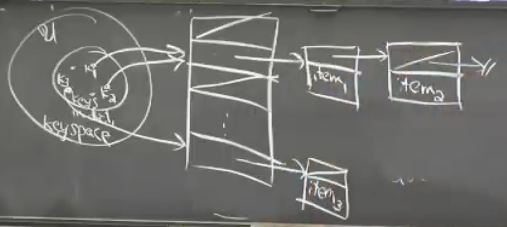
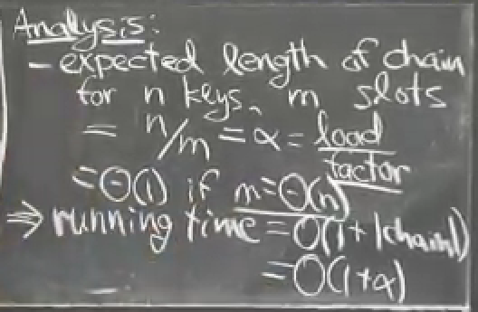
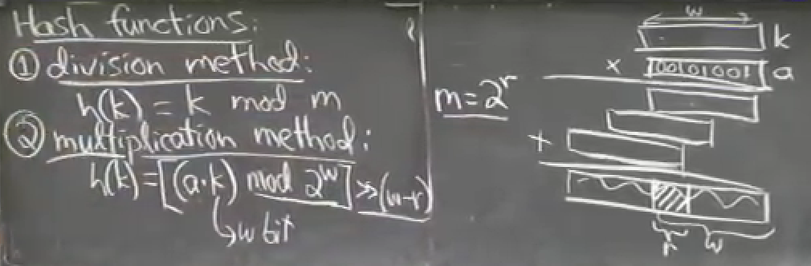
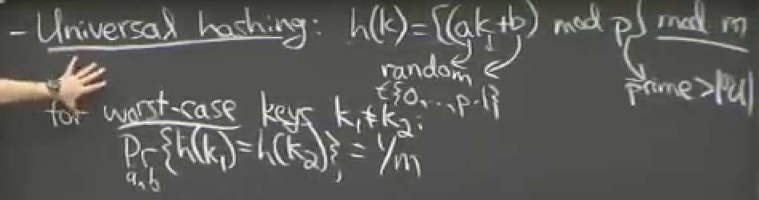
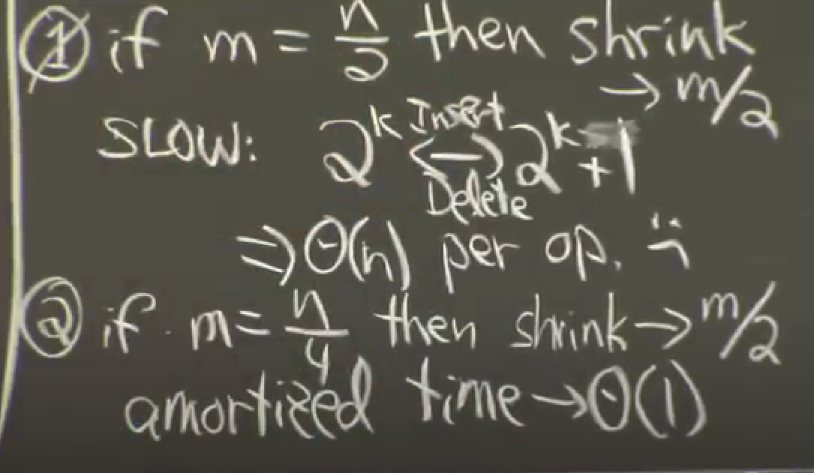

Purpose: To implement an abstract data type with following properties.
- Insertion of (key,value) pair, override if already exists.
- Search of key and its corresponding value, if exists, else reports non-existence.
- Deletion of key and its corresponding value.
Hashing: All in O(1) time complexity with high probability.
AVL: only gives O(logN)

Applications:
- Databases: Record(pkey) -> memory location/hash table -> contains all records with given location as hash of their pkey.
- Finding a given word/substring in a document (ctrl+F): how?
- Compilers/Interpreters: Mapping variable name to a memory location.[lookup table], is this really how memory locations of variables is determined.
- Routing/Serving: router maintains a hash table where key is IP add. [lookup table]-
- similarity of strings. How?
- File-system and directory sync i.e. have there been changes in a cloud directory and its local folder. How?
- Cryptographic hash functions.

Method 1:
- Each key is of form integers 
- we'll have a large array in our memory, and each index of that array will correspond to a key and will be filled with value.

Problems:
1. Not every key is an integer.
2. We have limited memory. (keys can get very large)

Mitigation:
1. Convert each key into a non neg integer. (Pre-hashing)
In theory (not sure if practical or not): everything can be converted to bits and bits can be converted to a number. It is not reversible but idt it's needed anyway.
Can implement your own function for this using doubleunderscore(hash)doubleunderscore in python
2. Map each integer key to a location in the memory. (Hashing)
        {set of n keys}  ->    {set of m locations} where m ~ O(n), making it limited in memory size.
        and the keys and their locations are dynamically decided, i.e. the keys and their corresponding locations can be inserted and removed.HOW? Ensuring this will probably lead to collisions because the universe of POSSIBLE keys is extremely large but our hash table is rationally of limited size, in proportion to no of keys currently present.
        this set of m locations is aka hash table.
        Hash function does the work of mapping the universe of keys to m slots.
Assumptions:
- Value of keys don't change because the hash of a key is determined at the first insertion.

Issues:
- Collision: When multiple keys will correspond to the same hash.
- 

Collision Handling:
## 1. Chaining:
 For all the items corresponding to the same hash, put them in a list of elements whose head is referenced at the hash's location. Now the whole array will act like an array of linked lists rather than elements.
- In worst case all the items are in the same list so the complexity is O(n) but in practice, hashing distributes the items nicely because randomization is involved.
### Simple Random Hashing
Based on a false assumption but it helps in analysis of hashing.
- Each key is equally likely to be hashed to any random slot out of given slots and that is independent of where other keys hash to.
This is an assumption of uniformity, of keys individually and together too.

Hash Function:
How to map the universe of keys to a set of m slots.
1. Division method: h(k)=k%m where m is a prime no. as far away from powers of 2 and 10 as possible.
2. Multiplication method: 
        h(k)=((a.k)%(2^w)) >> (w-r)
        Multiply k by a random odd number between 2^(r-1) and 2^r, called a. then take the right half of the bitwise reprn of the result using modulo 2^w, then take the leftmost r bits by right shifting by (w-r). Here w is the word size and r relates to no of slots m by: m=2^r. ie. we assume m to be a power of 2.
        This only works because of randomization added to the algo by the number a.
3. Universal Hashing: 
h(k)=[(a.k+b) mod p] mod m
a,b are random nos less than p
p is a large prime no. with value > size of universe of keys. Is it random too?

### Table Doubling:
We keep a definite size of m because it denotes the current no of indices available so that we hash accordingly.
1. When no of elements exceed current m, we double the size of the table and rehash all the present elements.
2. When no of elements falls below m/3 or m/4 (just not m/2) we reduce the size of the table to m/2.
Why not m/2?
Because at the point of 2^k <-> 2^k+1, we will keep doubling and reducing size of table and rehashing back and forth, making our complexity O(n).

there are methods that do table   resizing in parallel, so that qhwn requirement comes, our table is ready
what is amortization