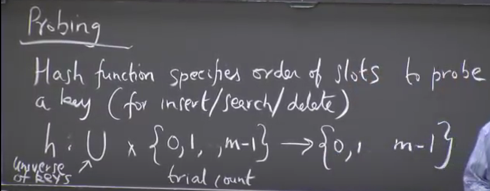
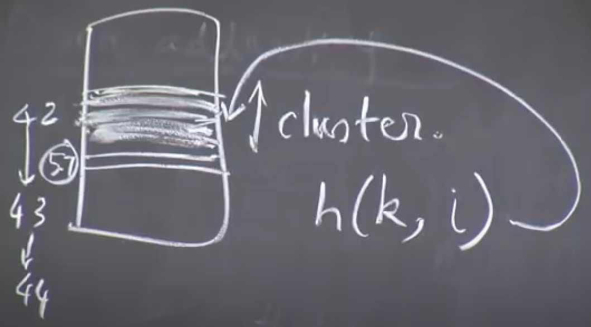

No chaining
Each index in the hash table only stores one item.
and we know that we don't fill the hash table in a particular sequence, we fill it in a non-sequential manner, so in case of a collision, we'll need another index to store the new item, which will be stored at a new index and that is not guaranteed to be near the original index. so the length of our hash table would be m >= n.
Really? I think it's because in case of chaining we can potentially have m < n as we can have multiple elements in one slot. But here, only m>=n is possible. 

Probing:
We compute the hash of a given key and if that slot is taken, we compute a slightly different hash for the same key and see if that slot is available.
Hence, hash function here will take two arguments: a key and a trial number(which trial is this) and will return a slot between 0 and m-1

For hashing to work efficiently, we want h(K,1), H(k,2), ... H(k,m) to be a permutation of [0,m-1]. because:
1. we want to cover all the slots. (in case say there is only one slot left in the table, we should be able to reach it. + load balancing the table.)
2. we want each trial to result in a different index.

Insert:
- Keep calculating hash with increasing trials.
- If find a none or delete flag, insert there.

Search:
- Keep calculating hash with increasing trials, and compare the key with what's in the slot:
1. If the slot contains another key or has a delete flag (because what was present was deleted), continue with next trial.
2. If the slot contains none flag, the key doesn't exist because if it did, the slot would have been filled at the time of insertion of the same key or another key but would not have remained none.
3. If the slot's value is same as key, return
4. report that key doesn't exist after m trials.

Delete:
- Keep calculating hash with increasing trials, and compare the key with the slot:
1. If the slot contains another key or has a delete flag (because what was present was deleted), continue with next trial.
2. If the slot contains none flag, the key doesn't exist because if it did, the slot would have been filled at the time of insertion of the same key or another key but would not have remained none.
3. If the key is same as slot's value, fill the slot with delete flag.
4. report that key doesn't exist after m trials.

## Hash Function
Does for the same key and same trial, we get the same hash?

### Probing Strategies
1. Linear Probing: H(k,i) = (h(k)+i)%m, this satisfies the permutation rule. but it can result in clusters of consecutive keys which keep growing because say a trial resulted in miss, next consecutive slots are probably going to be filled too and then the new key would just occupy a slot very next to them. There is no randomness here.

2. Double Hashing: H(k,i) = (h1(k) + i*h2(k))%m
this will only satisfy the permutation property if h2(k) and m are relatively prime.
possible when h2(k) is always odd and m ~ 2^r

### Uniform Hashing Assumption
Each key is equally likely to have any one of the m! possible permutations as its probing sequence.
difficult to achieve but double hashing performs really good on it.
alpha = n/m, where m is the total no of slots.

no of trials required for insert(on avg.)<= 1/(1-alpha). so when alpha gets close to 1 ie n->m
hence in practice, we resize our table when alpha crosses 0.5 or so. and then we rehash all the existing keys too.(we can clear the delete flags during rehashing)
- The time complexity being O(1) here is entirely based on randomness of the algorithm.
## Cryptographic Hash
1. Password Storage:
Use a one way and one-one hash function to store the passwords and verify a user.
one-way means given hash of some x, its very hard to find x
one-one means that each x has a different h(x) OR given a hash value q, its very hard to find two literals x and y s.t. h(x)=q and h(y)=q