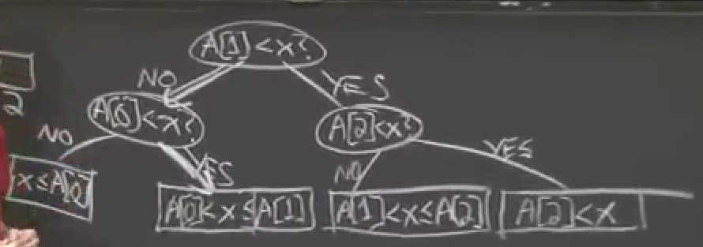

## Quick Sort
### Partition Function
relatively sorts the array around pos position. meaning:
- The element (say x) that would have been present at position pos if the array was sorted, will be present at that pos when this func ends.
- while the rest of the array might not be completely sorted, it would be relatively sorted around x, i.e those smaller than x would be present before x and those larger than x would be present after x. (sorted or unsorted)
- the partition algo is hard to come up by yourself, so remember it.
### Quick Sort Function
- calls partition on the given array.
- through partition function, one position i.e. pivot is sorted. So the quick Sort function is called again on left and right side of pivot.
## Quick Select
- We need to find which element would occur at position k, if the array was sorted.
- To determine this, we need not sort the whole array. (usually)
- We play our luck with the partition algorithm of quick sort which places any given element (called pivot) at its sorted position and we see if that sorted position is equal to our desired position. 
- If yes, then we return pivot, else we again call the quick select function on one half of the array. (see in code)
- In worst case we will end up sorting the whole array with the complexity of quick sort: Big-O(n^2)
## Heap Sort
- have a heap(max-heap) corresponding to the array to be sorted
- extract the max element one by one to have the array sorted in decreasing order
- Time Complexity: O(NlogN) and theta(NlogN).
## Merge Sort
- Have an array to be sorted, divide it into two parts and call the merge sort function on those two parts. Now the parts are sorted(process is explained below), just merge them.
- If we divide the parts long enough, we'll reach individual elements which are already sorted. So the merge process will start with merging two individual elements into a single array and will progress all the way up to top.
- In the merge process, we use the two finger approach in which we have pointers to the beginning of the two sorted arrays, and we take the smaller of the two pointed elements into our merged array and increase the corresponding pointer and then repeat this process.
## Insertion Sort
For each element from left to right:
- The left side of array to current the element is already sorted, so we just have to place that element in its right position in that array, 
- and we do that by swapping the element with its left element in case the left element is larger than the current element.

## Comparison Model:
- The inputs are Abstract Data Types (ADTs: any data structure) and a comparison function is given which tells which of the object of type ADT is smaller.
- The execution can be represented in the form of a decision tree. Various properties of that tree:
INSERT IMAGE HERE

- Searching for lower bounds:
 O(logN) once you have a preprocessed list of items. Because no matter the algo you are following, each comparison divides the array in half.
 + Also because the binary decision tree contains all the possible outcomes, but we will only need to reach one outcome by following any algorithm, which is possible by following only one path (in case of binary search) which would be atleast logN long.

 ### Sorting in comparison model.
 
 
 Why are the no of possible leaves in case of sorting n!? This considers all possible arrays of length n yep => all possible permutations.
 And then for our array, it will only follow one path to lead to the sorted array, whose height would be log(n!)~nlogn
this can be derived by two methods:
1. stirling theorem
2. taylor series expansion's first term.
actually it turns out to be O(nlogn)-O(n)

### Integer Sorting:
because integers are already represented in a sorted order in our memory.
how does this work
- assuming they all are integers and lie in range [0,k)
- And for small k, the sorting algo tends to be linear only.

### Counting Sort:
create an array whose values are the counts of indices.
- then starting from the front, the sorted array will contain value consecutive occurences of the index, and rest indices after that.
- what if we are not just sorting numbers but records of data whose just one attribute is the key on the basis of which we are sorting.
- we create vector of vectors and keep pushing back the record to its corresponding 1d vector in the 2d vector.
- and then for each value in each index of 2d vector starting from beginning, extend that value in the sorted array.
Complexity: O(n+k) because k can get little bit bigger than n and not each value from 0 to k will be having associated elements but we'll still need to traverse them all.
- What if through counting sort, we had a secondary attribute on the basis of which we wanted to sort the elements with equal primary attribute.
Refer Radix sort for that.

### Radix Sort:
- Imagine each integer in base b.
- No of digits: log base b of K where K is the max number in the list. Works for k=n^constant
- Algo: sort the elements by LSB, then next LSB, and so on till the MSB.
- Complexity: nlogK at base b
- Magical and correct.
- And because the base representation can have multiple values at each digit (say base b>2), we sort on basis of each digit using counting sort, which has complexity O(n+b).
- hence total time: O((n+b).logK), log being base b 
- choosing b to minimize this complexity. should be min(n,k). which is usually n.
